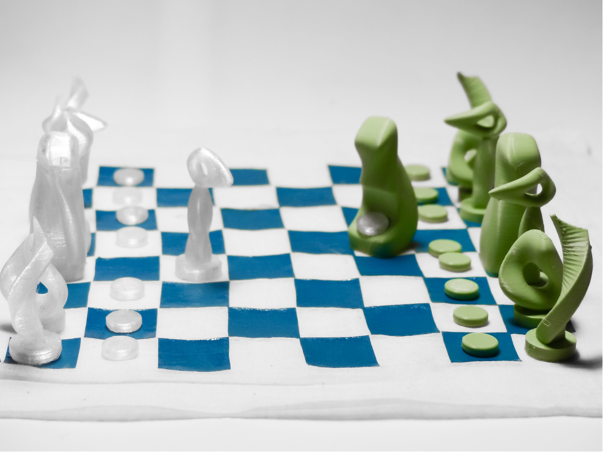

# Xadrez DOXA / DOXA Chess

Transformar uma batalha mental e espiritual num jogo inspirado no xadrez, onde a procura pela glória de Deus supera o caos, a ansiedade e os julgamentos humanos. [ENG] Transforming a mental and spiritual battle into a chess-inspired game, where the pursuit of God's glory overcomes chaos, anxiety, and human judgment.

## Conceito/Concept

O projeto DOXA surgiu durante um período de bloqueio criativo vivido ao longo do semestre na Unidade Curricular de Design, em simultâneo com a frequência do primeiro ano da Licenciatura em Teologia, a partir desta experiência pessoal, surgiu a vontade de representar visualmente a batalha mental e espiritual que estava vivenciando.

O ponto de partida foi o xadrez, um jogo historicamente associado à simulação de estratégias e batalhas reais. No entanto, em vez de representar um conflito militar, o projeto procura representar um conflito interior, a estrutura e os movimentos do xadrez foram mantidos, mas o significado das peças, os seus objetivos e a narrativa do jogo foram completamente transformados.

A peça central do jogo é a Doxa, a palavra 'doxa', no grego koiné, significava originalmente opinião ou senso comum, mas no contexto do Novo Testamento passou a ser utilizada para descrever a glória de Deus, por esse motivo, a peça Doxa simboliza a Glória de Deus e torna-se o objetivo final do jogo. 

A rainha foi substituída pelo Espírito, numa referência ao Espírito Santo, os peões representam as personas humanas, o bispo foi transformado em doxa (senso comum e julgamento social), o cavalo em Caos (ansiedade e autocobrança) e a torre em Fortaleza (a ideia de autossuficiência e esforço humano). Todas estas peças possuem um encaixe para receber a persona na parte inferior de cada peça com exceção da Doxa (rei) e Espirito (rainha), simbolizando a forma como carregamos e somos moldados por determinados sentimentos ou acontecimentos.

O objetivo do jogo consiste em conduzir a persona até à peça Doxa através da ação do Espírito. Quando a confusão, a ansiedade e os julgamentos são confrontados pela Glória de Deus, surge clareza, direção e paz.

[ENG] The DOXA project emerged during a period of creative block experienced throughout the semester in the Design course, while simultaneously attending the first year of a Theology degree. From this personal experience came the desire to visually represent the mental and spiritual struggle I was facing.

The starting point was chess, a game historically associated with the simulation of strategies and real battles. However, rather than representing a military conflict, the project seeks to portray an inner conflict. The structure and movement patterns of chess were maintained, but the meaning of the pieces, their objectives, and the game's narrative were completely transformed.

The central piece of the game is Doxa. The word _doxa_, in Koine Greek, originally meant opinion or common sense, but within the context of the New Testament it came to be used to describe the glory of God. For this reason, the Doxa piece symbolizes the Glory of God and becomes the ultimate goal of the game.

The Queen was replaced by the Spirit, representing the Holy Spirit. The pawns represent human personas. The Bishop was transformed into _doxa_ (common sense and social judgment), the Knight into Chaos (anxiety and self-pressure), and the Rook into Fortress (the idea of self-sufficiency and human effort).

All of these pieces, except for Doxa (King) and Spirit (Queen), contain a slot at their base designed to hold a persona. This feature symbolizes how we carry and are shaped by certain emotions, influences, and life experiences.

The objective of the game is to guide the persona towards the Doxa piece through the action of the Spirit. When confusion, anxiety, and judgment encounter the Glory of God, clarity, direction, and peace emerge.

## Tecnologias Usadas / Technologies Used

Uma ou mais tecnologias estudadas em laboratório:

- [x] Corte 2D (laser / vinil)
- [x] Impressão 3D
- [ ] CNC
- [ ] Micro:bit / computação física
- [x] Modelação 3D no Autodesk Fusion 360
- [x] Aplicação de vinil sobre tecido

## Processo/ Process

A linguagem formal de cada peça foi desenvolvida a partir do conceito que representa. [ENG]The formal language of each piece was developed directly from the concept it represents.

A peça Caos foi inspirada por figuras humanas curvadas em sofrimento e agonia, procurando transmitir ansiedade, pressão e instabilidade emocional.
[ENG]The Chaos piece was inspired by human figures bent over in suffering and agony, seeking to convey anxiety, pressure, and emotional instability.

A peça doxa (julgamento social) foi inspirada por um corpo projetado para a frente numa posição semelhante a um mergulho, transmitindo uma sensação de invasão e interferência constante.
[ENG]The doxa piece (social judgment) was inspired by a human body projected forward in a diving-like position, conveying a sense of invasion and constant interference.

A peça Fortaleza foi inspirada por uma figura humana em esforço extremo, esticando-se para cima até ao seu limite, simbolizando a tentativa de alcançar realização apenas através da força pessoal.
[ENG]The Fortress piece was inspired by a human figure stretching upward to its absolute limit, symbolizing the attempt to achieve fulfillment solely through personal effort and self-reliance.

Por oposição, as peças Espírito e Doxa apresentam formas mais fluidas e orgânicas, refletindo a forma como a espiritualidade é entendida no projeto: simultaneamente robusta e fluida.
[ENG]In contrast, the Spirit and Doxa pieces feature more fluid and organic forms, reflecting the way spirituality is understood within the project: simultaneously robust and fluid.

Esbocei todas as peças após unir referências relacionadas com os conceitos do projeto.
[ENG] I sketched all the pieces after gathering references related to the project's concepts.

[https://a360.co/4uularh](https://a360.co/4uularh)

Iniciei a modelação tridimensional das peças no Fusion 360.
[ENG]I began the three-dimensional modelling of the pieces in Fusion 360.

Realizei o corte do vinil na Silhouette Cameo 3, utilizando quadrados com aproximadamente 2,5 cm × 2,5 cm para a construção do tabuleiro.
[ENG] I cut the vinyl using the Silhouette Cameo 3, creating approximately 2.5 cm × 2.5 cm squares to construct the game board.

Apliquei o vinil num saco de algodão previamente adquirido, transformando-o simultaneamente em tabuleiro de jogo e elemento de armazenamento das peças.
[ENG] I applied the vinyl onto a pre-purchased cotton drawstring bag, transforming it simultaneously into the game board and the storage solution for the pieces.
### Iteração  — [teste de impressão]

Foram realizadas várias iterações de modelação e impressão para ajustar proporções, encaixes e estabilidade das peças, durante a primeira tentativa, verificou-se que algumas peças não estavam corretamente posicionadas na base de impressão, o que originou falhas no processo de fabrico.
As iterações seguintes permitiram corrigir estes problemas e otimizar a qualidade e a estabilidade das peças finais.

[ENG] Several modelling and printing iterations were carried out to refine the proportions, connections, and stability of the pieces. During the first attempt, some of the pieces were not correctly positioned on the print bed, resulting in manufacturing failures. Subsequent iterations allowed these issues to be corrected and improved the overall quality and stability of the final pieces.

## Resultado Final

O resultado final consiste num jogo inspirado no xadrez tradicional, reinterpretado como uma representação física de uma batalha espiritual e psicológica.
As peças foram modeladas digitalmente e produzidas através de impressão 3D. O tabuleiro foi aplicado diretamente num saco de tecido através de vinil cortado na Silhouette Cameo 3 Alpha Branco
Esta solução permitiu reunir armazenamento e superfície de jogo num único objeto. Quando fechado, o saco serve para guardar as peças; quando aberto, transforma-se no próprio tabuleiro onde decorre a partida.
O projeto procura demonstrar como o design pode ser utilizado como ferramenta de reflexão, transformando experiências pessoais em objetos físicos capazes de comunicar ideias complexas.

[ENG] The final result is a game inspired by traditional chess, reinterpreted as a physical representation of a spiritual and psychological battle.
The pieces were digitally modelled and produced through 3D printing. The game board was applied directly onto a fabric bag using vinyl cut with the Silhouette Cameo 3.
This solution allowed storage and gameplay surface to be combined into a single object. When closed, the bag serves as storage for the pieces; when opened, it becomes the game board on which the match takes place.
The project seeks to demonstrate how design can be used as a tool for reflection, transforming personal experiences into physical objects capable of communicating complex ideas.

## Reflexão

Este projeto permitiu explorar a relação entre design, simbolismo, teologia e experiência pessoal, o desenvolvimento das peças demonstrou como decisões formais podem transmitir significados abstratos e emocionais.
Numa futura iteração, gostaria de aprofundar a mecânica do jogo, desenvolvendo regras exclusivas que reforcem ainda mais a narrativa conceptual do projeto e a relação simbólica entre as peças. Pretendo também explorar novas soluções para o tabuleiro, concebendo estruturas que funcionem simultaneamente como superfície de jogo e sistema de armazenamento das peças.
Para isso, seria interessante experimentar tecnologias como a CNC ou a impressão 3D para o tabuleiro, permitindo desenvolver versões mais integradas e funcionais do objeto.

[ENG] This project allowed me to explore the relationship between design, symbolism, theology, and personal experience. The development of the pieces demonstrated how formal design decisions can communicate abstract and emotional meanings.
In a future iteration, I would like to further develop the game's mechanics by creating unique rules that strengthen the project's conceptual narrative and the symbolic relationships between the pieces. I would also like to explore new solutions for the board, designing structures that function simultaneously as a playing surface and a storage system for the pieces.
To achieve this, it would be interesting to experiment with technologies such as CNC machining or 3D printing for the board itself, enabling the development of more integrated and functional versions of the object.