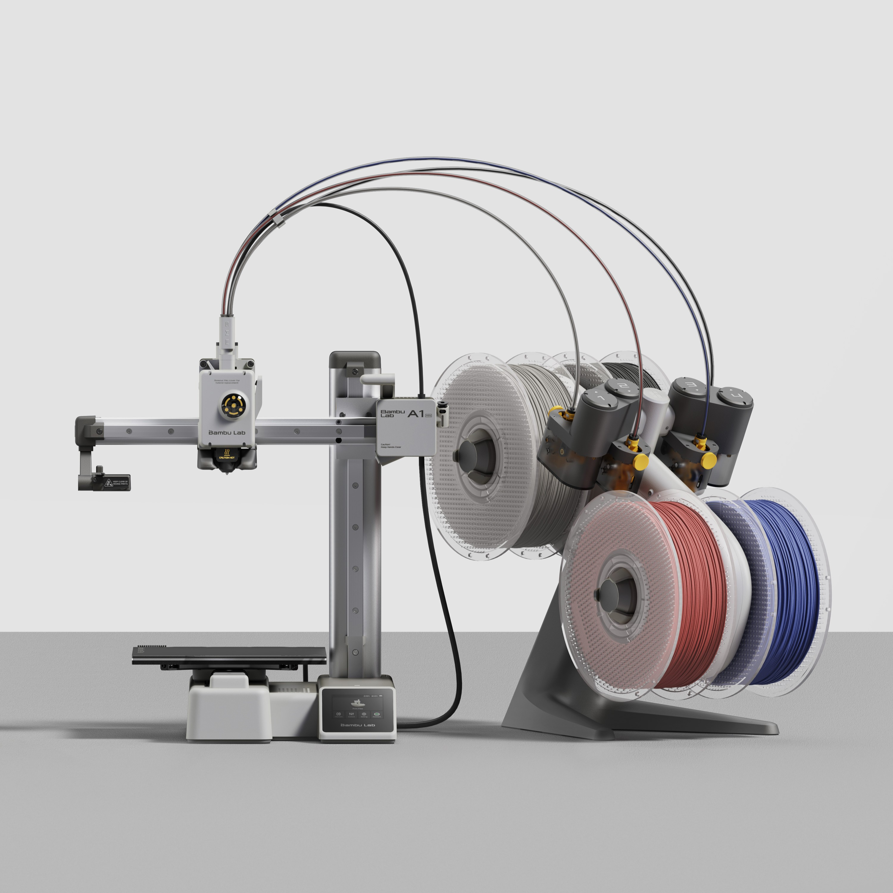
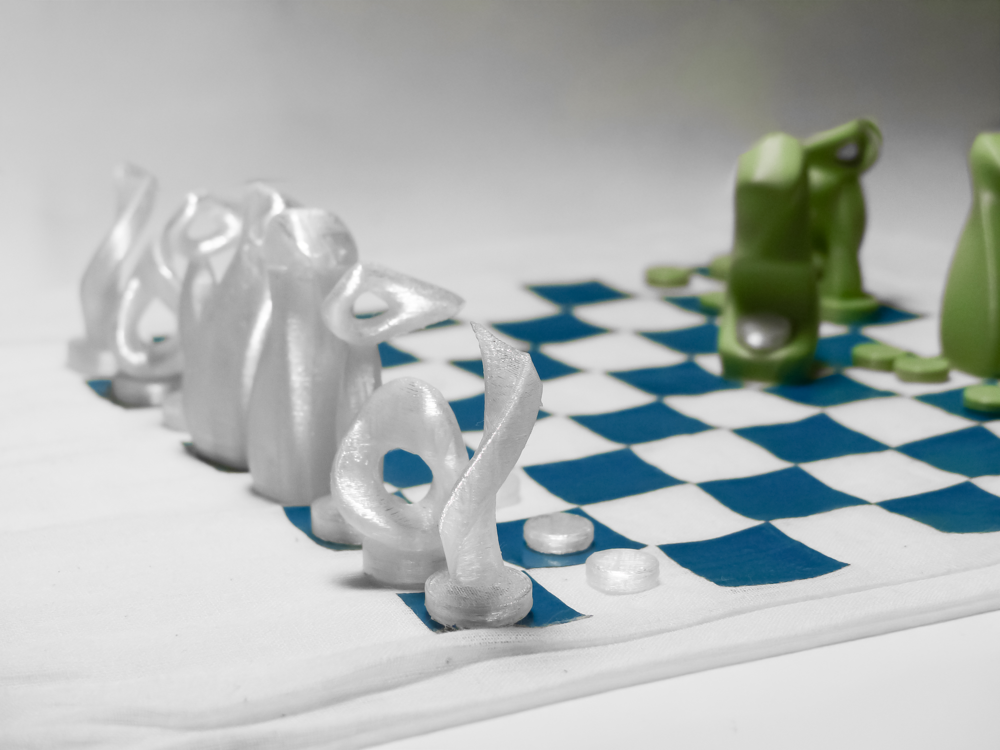

# Nome do Grupo

> Entre a documentação técnica e a exploração criativa, o grupo JIM utilizou o fabrico digital para transformar ideias em objetos, processos e experiências. 
> 
> **[ENG]**  Between technical documentation and creative exploration, the JIM group used digital fabrication to transform ideas into objects, processes, and experiences.

## Elementos do Grupo

| Número  | Nome             |
| ------- | ---------------- |
| 2024280 | Mariana Ferretto |
| 2024277 | Matilde Jorge    |

---

## Tutoriais de Máquinas

Este grupo desenvolveu tutoriais de utilização para a cortadora de vinil Silhouette Cameo 3 Branco e para a impressora 3D Bambu Lab A1 Mini, documentando os respetivos processos de preparação, operação e pós-produção, em simultâneo, cada elemento desenvolveu um projeto individual recorrendo às tecnologias exploradas em laboratório, aplicando conhecimentos de modelação digital, impressão 3D e fabrico assistido por computador, o conjunto dos trabalhos reflete tanto a componente técnica de aprendizagem das máquinas como a sua aplicação em projetos de caráter conceptual e criativo.

**[ENG]**  The group developed user guides for the Silhouette Cameo 3 vinyl cutter and the Bambu Lab A1 Mini 3D printer, documenting their preparation, operation, and post-production processes. At the same time, each member developed an individual project using the technologies explored in the laboratory, applying knowledge of digital modelling, 3D printing, and computer-aided manufacturing.
Together, these works reflect both the technical learning involved in understanding digital fabrication tools and their application in conceptual and creative design projects.

<!-- Cada thumbnail liga ao tutorial. Cada tutorial vive em
     tutoriais/<nome-da-maquina>/index.md (renomear `_modelo`). -->

<!-- markdownlint-disable MD033 -->

  <a class="gallery-card" href="tutoriais/bambu/">
    
    <h3>Bambu Lab A1 mini</h3>
    
Tutorial detalhado

  </a>

  <a class="gallery-card" href="tutoriais/silhouette/">
    
    <h3>Silhouette Cameo 3</h3>
    
Tutorial detalhado

  </a>

<!-- markdownlint-enable MD033 -->

---

## Galeria de Experiências Individuais

<!-- Duplicar o bloco abaixo para cada elemento e substituir `_modelo` em
     ambos os caminhos por `<numero>-<nome>`. -->

<!-- markdownlint-disable MD033 -->

  <a class="gallery-card" href="experiencias/2024277-Matilde/">
    
    <h3>Breath Builder</h3>
    
Matilde Jorge

  </a>
<a class="gallery-card" href="experiencias/2024280-Mariana/">
    
    <h3>Xadrez DOXA</h3>
    
Mariana Ferretto

  </a>

<!-- markdownlint-enable MD033 -->
