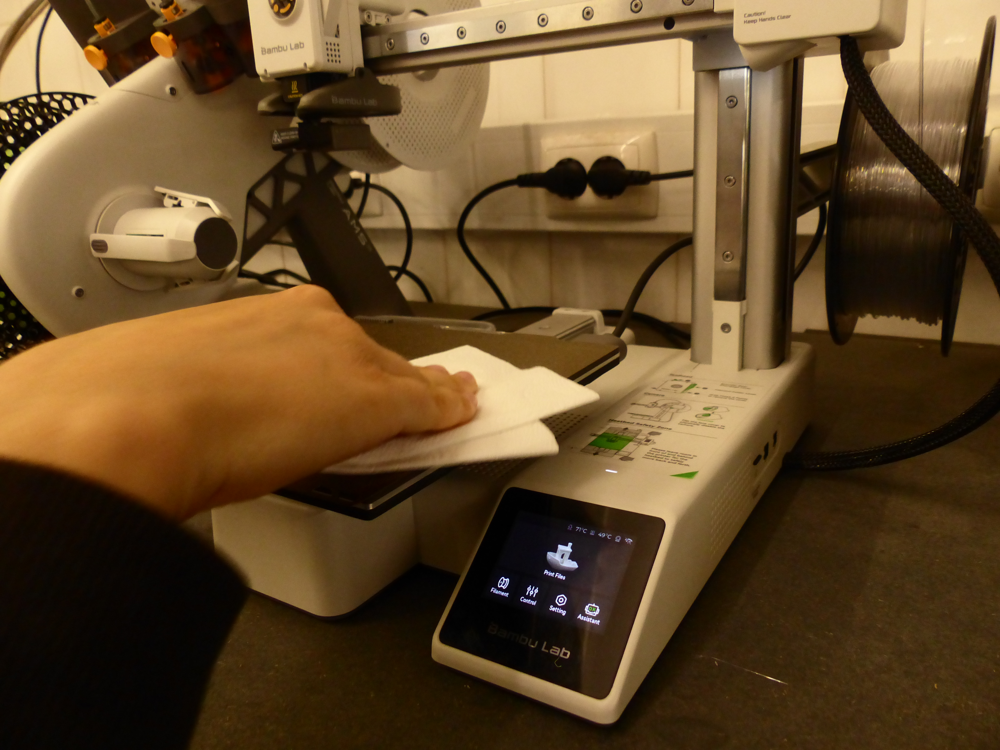

# Bambu Lab A1 mini

> A Bambu Lab A1 Mini é uma impressora 3D FDM de secretária utilizada para fabricar objetos físicos a partir de modelos digitais tridimensionais, é amplamente utilizada em contextos de prototipagem, design de produto, educação, engenharia e fabrico digital.
> 
> **[ENG]**  The Bambu Lab A1 Mini is a desktop FDM 3D printer used to manufacture physical objects from digital 3D models. It is widely used in prototyping, product design, education, engineering, and digital fabrication projects.

## 1. Como desenhar para esta tecnologia?

De modo a dar corpo a um projeto através da Bambu Lab A1 mini é necessário desenhar e preparar o ficheiro num software de modelação 3D tais como o Fusion 360, o Blender e outros.
É importante mencionar que existem plataformas que disponibilizam diversos e imensos modelos 3D e STL gratuitos feitos por outros designers e criadores da comunidade. Destas plataformas indicamos a MakerWorld e a Thingiverse.

**[ENG]**  To create a project using the Bambu Lab A1 Mini, it is necessary to design and prepare the file in a 3D modelling software such as Fusion 360, Blender, or other similar programs.
It is also important to mention that there are several online platforms that provide free 3D models and STL files created by members of the maker community. Examples include MakerWorld and Thingiverse.

## 2. Como preparar um ficheiro para a máquina

Antes de ser impresso, o ficheiro do modelo 3D tem que ser processado através dum *slicer* de modo a que o mesmo seja convertido para um G-code. O slicer indicado para a Bambu Lab A1 mini é o Bambo Studio. 
Para abrir o ficheiro 3D dentro do Bambu Studio, o mesmo tem que ser importado num dos seguintes formatos suportados pelo slicer: .stl / .obj / .3mf

**[ENG]**  Before printing, the 3D model file must be processed through a slicer so that it can be converted into G-code.
The recommended slicer for the Bambu Lab A1 Mini is Bambu Studio.
To open the 3D model in Bambu Studio, the file must be imported in one of the supported formats:.stl / .obj / .3mf

	imagem 1 - preparação do ficheiro dentro do *slicer* Bambu Studio 
	**[ENG]**  Preparing the file inside Bambu Studio

**Preparação do ficheiro dentro do Bambu Studio**. 
Pontos importantes a ter em consideração são:
A. Impressora
	- selecionar a Bambu Lab A1 mini
	- selecionar o textured PEI plate
B. Filamento
	- selecionar o Generic PTEG  
C. Suporte
	- caso a peça que será impressa necessite de apoio durante o processo de impressão, deverá ir à aba do Support e configurar de acordo com o necessário. 

**[ENG] **Preparing the File in Bambu Studio
Important settings to consider:

A. Printer
-Select **Bambu Lab A1 Mini**
-Select **Textured PEI Plate**
B. Filament
-Select **Generic PETG**
C. Supports
-If the object requires support structures during printing, open the **Support** tab and configure the settings according to the model's requirements.

	imagem 2 - configuração dos apoios 
	**[ENG]**  Support settings

 Quando a preparação do ficheiro estiver concluída pode ser realizado o *slice* do ficheiro completo ou de apenas um dos *plates*, onde então é criado o G-code para a impressão e nos são dadas mais informações tais como o tempo estimado da impressão.
 
**[ENG]**  Once the file preparation is complete, the model can be sliced, either for the entire project or for an individual plate. The slicer will generate the G-code and provide additional information such as the estimated printing time.

	imagem 3 - resultados do *slicer* no canto superior direito do ecrã 
	**[ENG]**  Slicer results displayed in the upper-right corner of the screen

E por fim o ficheiro deverá ser exportado, como mostrado na imagem 4 que se segue, no formato Gcode (neste caso .gcode.3mf) e assim o ficheiro estará pronto.

**[ENG]**  Finally, the file should be exported, as shown in Image 4, using the G-code format (in this case, .gcode.3mf). The file is then ready for printing.

	imagem 4 - selecionar export plate sliced file/ export all sliced file 
	**[ENG]**  Select “Export Plate Sliced File” or “Export All Sliced Files”
## 3. Antes de Começar

### 3.1. Segurança/Safety

 A máquina não deve ter nenhum outro objeto demasiado perto de modo a não provocar danos e/ou acidentes durante o funcionamento da máquina.
Certificar-se que a placa de montagem se encontra limpa e sem quaisquer outros objetos/resíduos/manchas em cima ao que os mesmos podem perturbar e impossibilitar o funcionamento da máquina. Caso seja necessário, deve-se usar um papel/toalha com álcool para limpar a superfície da placa de montagem e esperar que a mesma seque por completo antes de a utilizar.

**[ENG]**  No objects should be placed too close to the printer, as they may interfere with its operation and cause damage or accidents.
Ensure that the build plate is clean and free from dust, debris, stains, or any foreign objects that could affect print quality or prevent successful printing.
If necessary, clean the build plate using a paper towel and isopropyl alcohol, and allow it to dry completely before use.

	imagem 5 - limpeza da placa de montagem

Ter cuidado para não tocar na placa de montagem durante o período da impressão pois a mesma pode chegar até aos 80ºC! Pela mesma razão deve-se aguardar um pouco que a placa de montagem arrefeça assim que o processo de impressão tenha concluído, de modo a evitar acidentes ou queimaduras ao se retirar o objeto impresso de cima da placa.

**[ENG]**  void touching the build plate during the printing process, as temperatures can reach up to 80°C.
For the same reason, wait a few moments after the print has finished before removing the object, allowing the build plate to cool down and reducing the risk of burns or accidents.

## 4. Como operar a máquina passo-a-passo

Sequência operacional, com fotografias e/ou pequenos vídeos em cada passo crítico.

1. Ligar a impressora no botão que se encontra no fundo da impressora 
2. **[ENG]**  Turn on the printer using the power button located at the back of the machine.

	imagem 6 - botão para ligar/desligar a impressora 
	**[ENG]**  Printer power button

3. Ejetar o cartão SD da impressora através do menu: 
4. **[ENG]**  Eject the SD card through the printer menu:
*Settings* -> SD Card -> *Eject* -> confirmar *Eject*

	imagem 7 - passo-a-passo para ejetar o cartão SD no ecrã da Bambu Lab A1 mini 
	**[ENG]**  Step-by-Step Guide to Eject the SD Card on the Bambu Lab A1 Mini Screen

3. Retirar o cartão SD da máquina e conectá-lo ao dispositivo e copiar o ficheiro G-Code para o cartão.
4. **[ENG]**  Remove the SD card from the printer and connect it to the computer. Copy the G-code file onto the SD card.

	imagem 8 - local do cartão SD na Bambu Lab A1 mini 
	**[ENG]**  Location of the microSD card slot on the Bambu Lab A1 Mini.

4. Ejetar o cartão SD do dispositivo e voltar a colocá-lo na impressora
5. **[ENG]**  Safely eject the SD card from the computer and insert it back into the printer.

5. Começar a impressão/Start the print::
 *Print Files* -> selecionar o ficheiro -> *Start Printing*
 
	imagem 9 - passo-a-passo para começar a impressão
	 **[ENG]**  Step-by-Step Guide to Start Printing
## 5. Resultado e pós-produção

Após a impressão bem sucedida, retirar o objeto impresso de cima da placa de montagem recorrendo às "espátulas".

Ter muito cuidado nesta parte pois a placa de montagem ainda se encontra bastante quente logo após a conclusão da impressão!

Com o objeto retirado, os utilizadores podem vir a querer aprimorar o aspeto do mesmo, podendo optar por:
- retirar quaisquer suportes e "árvores" que possam ter tido aplicadas
- lixar as peças com as folhas de lixa adequadas para o acabamento desejado
- acabamentos com *primer* e tinta para pintar as peças
- montar as peças que possam constituir o objeto final

**[ENG]**  After printing, some finishing operations may be required depending on the project.

These may include:
- Removing support structures.
- Sanding rough surfaces.
- Assembly of multiple printed parts.
- Surface finishing and painting.
- Dimensional adjustments and fitting.

The required post-processing will depend on the intended use and level of finish desired for the printed object.

## 6. Recursos e Ficheiros

O ficheiro utilizado para referência deste tutorial foi feito no Autodesk Fusion 360 (modelo dum *breath builder*).
O *slicer* utilizado foi o Bambu Studio.

**[ENG]** The reference file used for this tutorial was created in Autodesk Fusion 360 and consists of a Breath Builder model.

The slicer used was Bambu Studio.

- obter o Autodesk Fusion 360: https://www.autodesk.com/pt/products/fusion-360/overview
- ficheiro do *breath builder* : https://a360.co/4vKpTGw
- obter o Bambu Studio: https://bambulab.com/en/download/studio
- Bambu Lab Wiki para auxílio com outras possíveis dúvidas: https://wiki.bambulab.com/en/a1/manual/how-to-print-from-sd-card