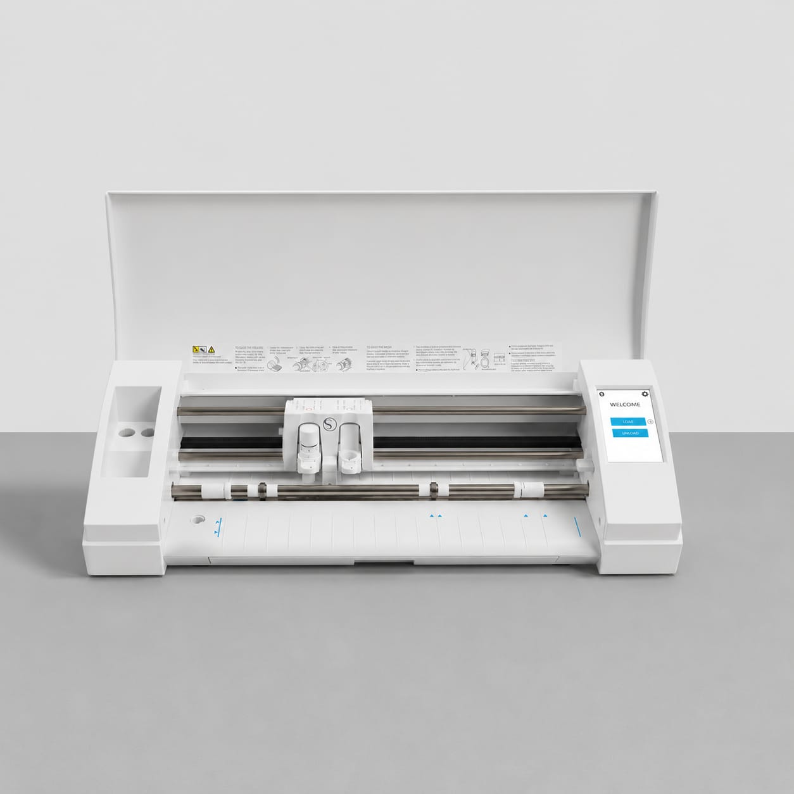
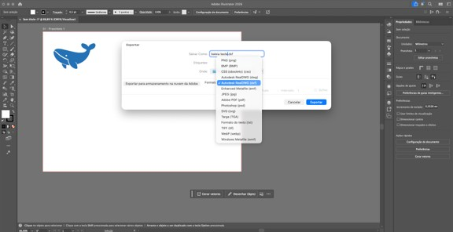
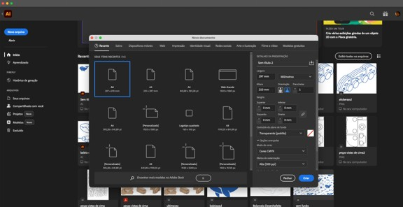
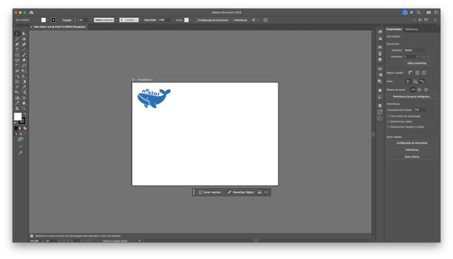
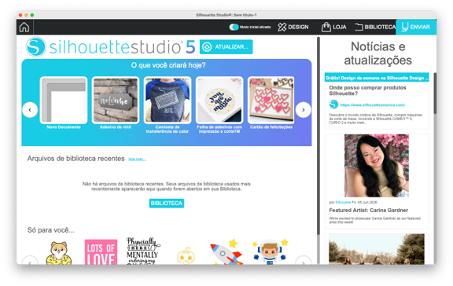
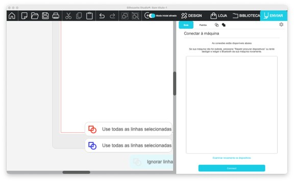
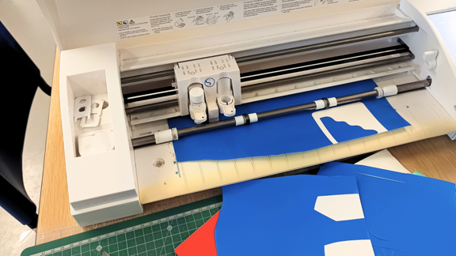
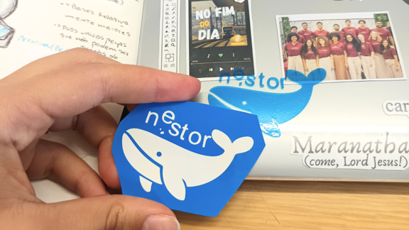
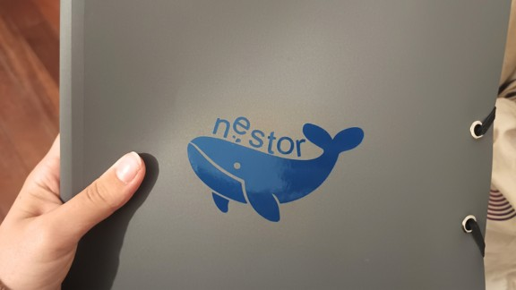

#  Cortadora de Vinil Silhouette Cameo 3 Branco
> A Silhouette Cameo 3 é uma plotter de corte digital que permite transformar desenhos vetoriais em cortes sobre diversos materiais, sendo utilizada em contextos de design, produção gráfica e prototipagem. 
>
**[ENG]** The Silhouette Cameo 3 is a digital cutting plotter that transforms vector drawings into precise cuts on a variety of materials, making it widely used in design, graphic production, and prototyping.

## 1. Como desenhar para esta tecnologia?

 A cortadora de vinil Silhouette funciona a partir de desenhos vetoriais, para utilizar essa tecnologia, o desenho deve ser criado em software vetorial, permitindo que a máquina siga as linhas definidas para realizar o corte.
Considerações de design:  
- Utilizar desenhos vetoriais.  
- Verificar se todos os elementos estão dentro da área de trabalho.  
- Evitar elementos demasiado pequenos ou difíceis de cortar.  
- Confirmar as dimensões finais do desenho antes da exportação.  
- Organizar corretamente os elementos na folha.  
No nosso teste foi utilizada uma folha em formato A4.

**[ENG]** The Silhouette vinyl cutter operates using vector drawings. To use this technology, the design must be created in vector-based software, allowing the machine to follow the defined paths and perform the cuts.
Design Considerations
- Use vector drawings.
- Ensure that all elements fit within the working area.
- Avoid elements that are too small or difficult to cut.
- Confirm the final dimensions of the design before exporting.
- Organize all elements correctly on the sheet.
In our test, an A4-sized sheet was used.
## 2. Como preparar um ficheiro para a máquina

Software utilizado:  
- Adobe Illustrator  
- Silhouette Studio  
  
O desenho foi criado no Adobe Illustrator e posteriormente preparado no Silhouette Studio. 

**[ENG]** The design was created in Adobe Illustrator and later prepared in Silhouette Studio. 
  
Formato de ficheiro:  
- DXF (.dxf)  
  
Durante o processo foi necessário criar o desenho em vetor, organizar o desenho numa folha A4, exportar em formato DXF e importar o ficheiro para o Silhouette Studio.

**[ENG]** During the process, it was necessary to create the design as a vector file, organize it on an A4 sheet, export it as a DXF file, and import it into Silhouette Studio.
## 3. Antes de Começar

### 3.1. Segurança/Safety

- Não tocar na lâmina da máquina 
- **[ENG]** Do not touch the machine blade.
- Não colocar as mãos na zona de corte durante o funcionamento. 
- **[ENG]** Do not place your hands in the cutting area while the machine is operating.  
- Manter a área de trabalho organizada. 
- **[ENG]** Keep the workspace organized.
- Confirmar que o material está corretamente colocado antes de iniciar o corte. 
- **[ENG]** Ensure that the material is correctly positioned before starting the cut.

### 3.2. Que tipo de ficheiros vou usar e onde os posso produzir

O ficheiro foi produzido no Adobe Illustrator através de desenho vetorial e exportado em formato DXF, posteriormente o ficheiro foi aberto no Silhouette Studio para preparação do corte.

**[ENG]** The file was created in Adobe Illustrator using vector graphics and exported as a DXF file. It was then opened in Silhouette Studio for cutting preparation.

## 4. Como operar a máquina passo-a-passo

1. Passo 1 — Criar o desenho vetorial no Adobe Illustrator.
2. **[ENG]** Step 1 — Create the vector design in Adobe Illustrator.

3. Passo 2 — Organizar o desenho numa área de trabalho A4.
4. **[ENG]** Step 2 — Arrange the design within an A4 workspace.

5. Passo 3 — Exportar o desenho em formato DXF.
6. **[ENG]** Step 3 — Export the design as a DXF file.

7. Passo 4 — Importar o ficheiro DXF para o Silhouette Studio.
8. **[ENG]** Step 4 — Import the DXF file into Silhouette Studio.

9. Passo 5 — Ligar o computador à Silhouette Cameo 5 Alpha Branco através de cabo USB.
10. **[ENG]** Step 5 — Connect the computer to the Silhouette Cameo 3 using a USB cable.

11. Passo 6 — Colocar o material de corte na máquina.
12. **[ENG]** Step 6 — Load the cutting material into the machine.

13. Passo 7 — Verificar se o ficheiro foi corretamente importado e se está pronto para ser cortado.
14. **[ENG]** Step 7 — Check that the file has been correctly imported and is ready to be cut.

15. Passo 8 — Iniciar o corte através do painel de controlo da própria máquina.
16. **[ENG]** Step 8 — Start the cutting process using the machine’s control panel.

17. Passo 9 — Retirar cuidadosamente o material após a conclusão do corte.
18. **[ENG]** Step 9 — Carefully remove the material after the cutting process is complete.

19. Passo 10 — Aplicação na superfície desejada.
20. **[ENG]** Step 10 — Apply the final design to the desired surface.

## 5. Resultado e pós-produção

Após o corte, devem ser removidas as partes excedentes do material, preservando apenas o desenho final.

Dependendo da aplicação pretendida, poderá ser necessário realizar operações de acabamento ou aplicar o vinil numa superfície específica.

No caso de projetos que contenham elementos mais detalhados ou em maior quantidade recomenda-se a utilização de uma película adesiva de transferência, facilitando a aplicação e assegurando o correto posicionamento das partes como exemplificado nas imagens que se seguem.

**[ENG]**  After cutting, the excess material should be removed, leaving only the final design.

Depending on the intended application, it may be necessary to perform finishing operations or apply the vinyl to a specific surface.

For projects containing more detailed or numerous elements, the use of transfer tape is recommended. This facilitates application and ensures the correct positioning of all elements, as demonstrated in the following images.

imagem 1 - aplicação da película aderente transparente em cima do vinil 

**[ENG]** Applying the transparent transfer tape over the vinyl.

imagem 2 - levantar e começar a separar a película transparente do vinil. 

**[ENG]** Lifting and beginning to separate the transparent transfer tape together with the vinyl.

imagem 3 - aplicar o autocolante com a película na superfície. 

**[ENG]** Applying the vinyl design with the transfer tape onto the target surface.

imagem 4 - depois de meter alguma pressão e vincar o autocolante na superfície, retirar a película de cima do autocolante e da superfície, se necessário, utilizar um estilete para retirar quaisquer excessos que possam ter ficado. 

**[ENG]**  After applying pressure and ensuring adhesion, carefully remove the transfer tape. If necessary, use a craft knife to remove any remaining excess material.

Imagem 5 - transferência completa! 

**[ENG]**  Transfer completed successfully.
## 6. Recursos e Ficheiros

Os ficheiros utilizados foram produzidos no Adobe Illustrator e exportados em formato DXF para o Silhouette Studio. Como apoio ao processo foram utilizados os recursos disponibilizados pelo software e a documentação da Silhouette. 

**[ENG]**  The files used were created in Adobe Illustrator and exported as DXF files for use in Silhouette Studio. Additional support materials included the resources provided by the software and the official Silhouette documentation.
  
**Links externos:**  
- https://www.silhouetteeurope.eu/pt/silhouette-studio  
- Tutoriais do Silhouette Studio: https://youtu.be/8x3vkP6kATE?si=fN5wiS6GQNBdcRD-
