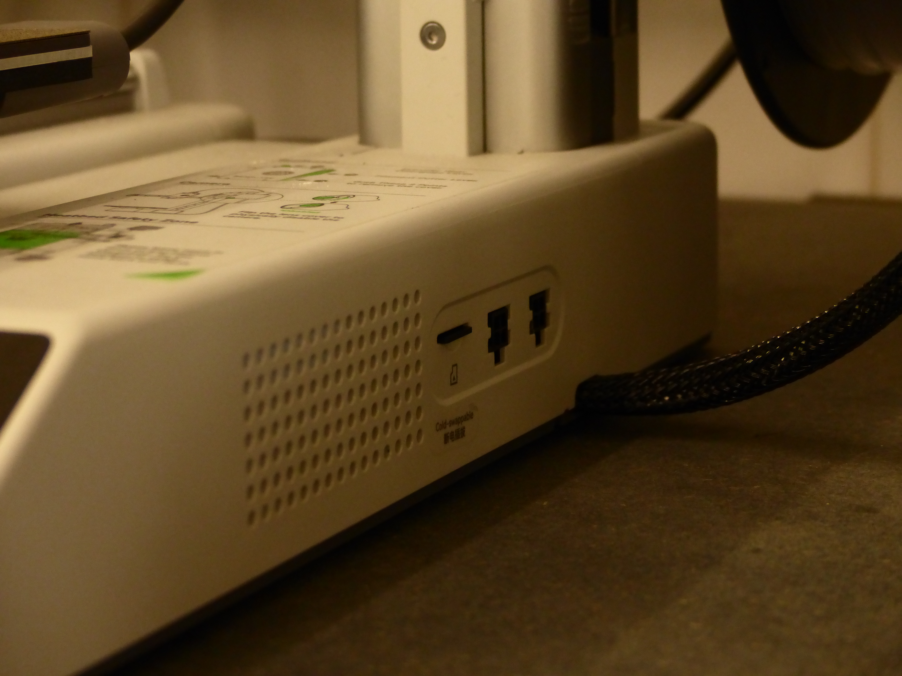

# Bambu Lab A1 mini

> The Bambu Lab A1 Mini is a desktop FDM 3D printer used to manufacture physical objects from digital 3D models. It is widely used in prototyping, product design, education, engineering, and digital fabrication projects.

## 1. How to Design for This Technology?

To create a project using the Bambu Lab A1 Mini, it is necessary to design and prepare the file in a 3D modelling software such as Fusion 360, Blender, or other similar programs.

It is also important to mention that there are several online platforms that provide free 3D models and STL files created by members of the maker community. Examples include MakerWorld and Thingiverse.

## 2. How to Prepare a File for the Machine

Before printing, the 3D model file must be processed through a slicer so that it can be converted into G-code.

The recommended slicer for the Bambu Lab A1 Mini is Bambu Studio.

To open the 3D model in Bambu Studio, the file must be imported in one of the supported formats:.stl / .obj / .3mf

	Image 1 – Preparing the file inside Bambu Studio

Preparing the File in Bambu Studio. 
Important settings to consider:
A. Printer
	- selecionar a Bambu Lab A1 mini
	- selecionar o textured PEI plate
B. Filamento
	- selecionar o Generic PTEG  
C. Suporte
	- caso a peça que será impressa necessite de apoio durante o processo de impressão, deverá ir à aba do Support e configurar de acordo com o necessário. 

	imagem 2 - configuração dos apoios

Quando a preparação do ficheiro estiver concluída pode ser realizado o *slice* do ficheiro completo ou de apenas um dos *plates*, onde então é criado o G-code para a impressão e nos são dadas mais informações tais como o tempo estimado da impressão.

	imagem 3 - resultados do *slicer* no canto superior direito do ecrã

E por fim o ficheiro deverá ser exportado, como mostrado na imagem 4 que se segue, no formato Gcode (neste caso .gcode.3mf) e assim o ficheiro estará pronto.

	imagem 4 - selecionar export plate sliced file/ export all sliced file
## 3. Antes de Começar

### 3.1. Segurança

 A máquina não deve ter nenhum outro objeto demasiado perto de modo a não provocar danos e/ou acidentes durante o funcionamento da máquina.

Certificar-se que a placa de montagem se encontra limpa e sem quaisquer outros objetos/resíduos/manchas em cima ao que os mesmos podem perturbar e impossibilitar o funcionamento da máquina. Caso seja necessário, deve-se usar um papel/toalha com álcool para limpar a superfície da placa de montagem e esperar que a mesma seque por completo antes de a utilizar.

	imagem 5 - limpeza da placa de montagem

Ter cuidado para não tocar na placa de montagem durante o período da impressão pois a mesma pode chegar até aos 80ºC! Pela mesma razão deve-se aguardar um pouco que a placa de montagem arrefeça assim que o processo de impressão tenha concluído, de modo a evitar acidentes ou queimaduras ao se retirar o objeto impresso de cima da placa.

## 4. Como operar a máquina passo-a-passo

Sequência operacional, com fotografias e/ou pequenos vídeos em cada passo crítico.

1. Ligar a impressora no botão que se encontra no fundo da impressora 

	imagem 6 - botão para ligar/desligar a impressora

2. Ejetar o cartão SD da impressora através do menu: 
*Settings* -> SD Card -> *Eject* -> confirmar *Eject*

	imagem 7 - passo-a-passo para ejetar o cartão SD no ecrã da Bambu Lab A1 mini

3. Retirar o cartão SD da máquina e conectá-lo ao dispositivo e copiar o ficheiro G-Code para o cartão.

	imagem 8 - local do cartão SD na Bambu Lab A1 mini

4. Ejetar o cartão SD do dispositivo e voltar a colocá-lo na impressora

5. Começar a impressão:
 *Print Files* -> selecionar o ficheiro -> *Start Printing*
 
	imagem 9 - passo-a-passo para começar a impressão
## 5. Resultado e pós-produção

Após a impressão bem sucedida, retirar o objeto impresso de cima da placa de montagem recorrendo às "espátulas".

Ter muito cuidado nesta parte pois a placa de montagem ainda se encontra bastante quente logo após a conclusão da impressão!

Com o objeto retirado, os utilizadores podem vir a querer aprimorar o aspeto do mesmo, podendo optar por:
- retirar quaisquer suportes e "árvores" que possam ter tido aplicadas
- lixar as peças com as folhas de lixa adequadas para o acabamento desejado
- acabamentos com *primer* e tinta para pintar as peças
- montar as peças que possam constituir o objeto final

## 6. Recursos e Ficheiros

O ficheiro utilizado para referência deste tutorial foi feito no Autodesk Fusion 360 (modelo dum *breath builder*).
O *slicer* utilizado foi o Bambu Studio.

- obter o Autodesk Fusion 360: https://www.autodesk.com/pt/products/fusion-360/overview
- ficheiro do *breath builder* : https://a360.co/4vKpTGw
- obter o Bambu Studio: https://bambulab.com/en/download/studio
- Bambu Lab Wiki para auxílio com outras possíveis dúvidas: https://wiki.bambulab.com/en/a1/manual/how-to-print-from-sd-card